---
## Front matter
title: "Лабораторная работа 3"
subtitle: "Научное программирование"
author: "Минов Кирилл Вячеславович | НПМмд-02-23"

## Generic otions
lang: ru-RU
toc-title: "Содержание"

## Bibliography
bibliography: bib/cite.bib
csl: pandoc/csl/gost-r-7-0-5-2008-numeric.csl

## Pdf output format
toc: true # Table of contents
toc-depth: 2
lof: true # List of figures
lot: true # List of tables
fontsize: 12pt
linestretch: 1.5
papersize: a4
documentclass: scrreprt
## I18n polyglossia
polyglossia-lang:
  name: russian
  options:
	- spelling=modern
	- babelshorthands=true
polyglossia-otherlangs:
  name: english
## I18n babel
babel-lang: russian
babel-otherlangs: english
## Fonts
mainfont: PT Serif
romanfont: PT Serif
sansfont: PT Sans
monofont: PT Mono
mainfontoptions: Ligatures=TeX
romanfontoptions: Ligatures=TeX
sansfontoptions: Ligatures=TeX,Scale=MatchLowercase
monofontoptions: Scale=MatchLowercase,Scale=0.9
## Biblatex
biblatex: true
biblio-style: "gost-numeric"
biblatexoptions:
  - parentracker=true
  - backend=biber
  - hyperref=auto
  - language=auto
  - autolang=other*
  - citestyle=gost-numeric
## Pandoc-crossref LaTeX customization
figureTitle: "Рис."
tableTitle: "Таблица"
listingTitle: "Листинг"
lofTitle: "Список иллюстраций"
lotTitle: "Список таблиц"
lolTitle: "Листинги"
## Misc options
indent: true
header-includes:
  - \usepackage{indentfirst}
  - \usepackage{float} # keep figures where there are in the text
  - \floatplacement{figure}{H} # keep figures where there are in the text
---

# Цель работы

Освоить базовые навыки работы в Octave: простейшие вычислительные операции, операции с веторами и матрицами, построение простейших графиков, сравнение циклов и операций с векторами.

# Теоретическое введение

Octave — высокоуровневый интерпретируемый язык программирования, предназначенный для решения задач вычислительной математики. По возможностям и качеству реализации интерпретатора язык Octave можно сравнивать с проприетарной программой MATLAB, причём синтаксис обоих языков очень схож. В состав пакета входит интерактивный командный интерфейс (интерпретатор Octave). Интерпретатор Octave запускается из терминала ОС Linux или из его порта в Windows. После запуска Octave пользователь видит окно интерпретатора.

В окне интерпретатора пользователь может вводить как отдельные команды языка Octave, так и группы команд, объединяемые в программы. Если строка заканчивается символом ";", результаты на экран не выводятся. Если же в конце строки символ ";" отсутствует, результаты работы выводятся на экран. Текст в строке после символа % является комментарием и интерпретатором не обрабатывается.

В Octave реализованы многие возможности Matlab, включая использование матриц в качестве основных типов данных, поддержку комплексных чисел, поддержку математических функции и больших библиотек функций, а также возможность создания пользовательских функций для расширения функциональности системы.

# Выполнение лабораторной работы

Простейшие операции

{ }
{ }

Операции с векторами и Вычисление проектора

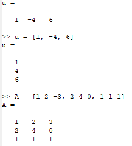{ }
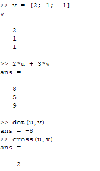{ }
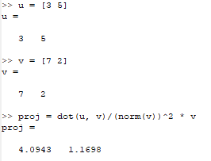{ }

Матричные операции

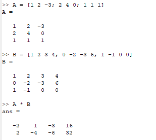{ }
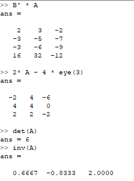{ }

Построение простейших графиков

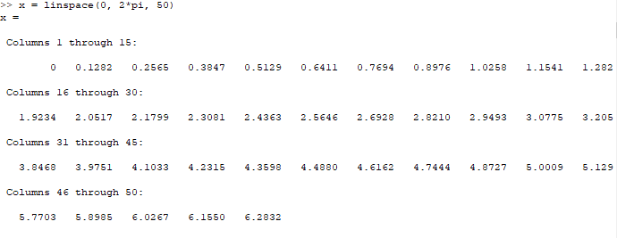{ }
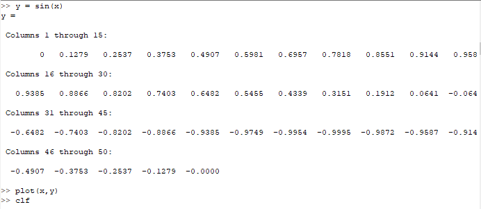{ }
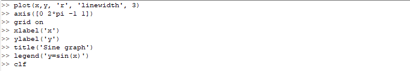{ }
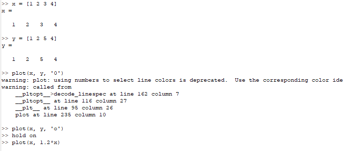{ }
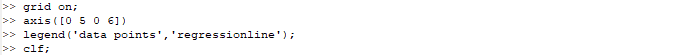{ }

Сравнение циклов и операций с векторами

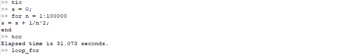{ }

Графики
{ }
{ }

# Выводы

В ходе выполнения данной лабораторной работы я освоил базовые навыки работы в Octave: простейшие вычислительные операции, операции с веторами и матрицами, построение простейших графиков, сравнение циклов и операций с векторами.

# Список литературы{.unnumbered}

::: {#refs}
:::

