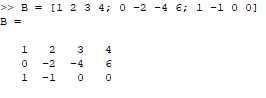
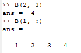
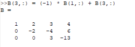
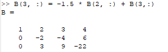
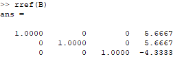
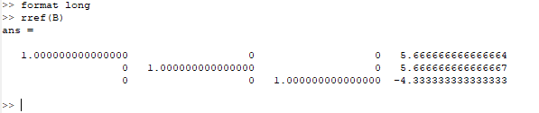
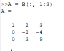
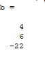
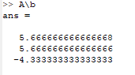
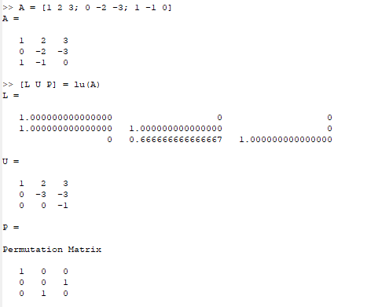

---
## Front matter
lang: ru-RU
title: Лабораторная работа №3
subtitle: Научное программирование
author:
  - Минов К. М., НПМмд-02-23
institute:
  - Российский университет дружбы народов, Москва, Россия

date: 23 сентября 2023

## i18n babel
babel-lang: russian
babel-otherlangs: english

## Formatting pdf
toc: false
toc-title: Содержание
slide_level: 2
aspectratio: 169
section-titles: true
theme: metropolis
header-includes:
 - \metroset{progressbar=frametitle,sectionpage=progressbar,numbering=fraction}
 - '\makeatletter'
 - '\beamer@ignorenonframefalse'
 - '\makeatother'
---

## Цель лабораторной работы

Изучить встроенные в Octave алгоритмы, необходимые для решения систем линейных уравнений.

## Теоретическое введение

Запишем исходную систему

\begin{equation} \begin{cases} a_{1}^{1}x^{1}+...+ a_{n}^{1}x^{n} = b^{1} \ ...\ a_{1}^{m}x^{1}+...+ a_{n}^{m}x^{n} = b^{m} \end{cases} \end{equation}

в матричном виде: 
Матрица A называется основной матрицей системы, b — столбцом свободных членов.

Алгоритм решения СЛАУ методом Гаусса подразделяется на два этапа:

прямой ход: приводим к треугольной матрице;
обратный ход: выражаем базисные переменные через небазисные.

LU-разложение — это вид факторизации матриц для метода Гаусса. 

# Ход выполнения лабораторной работы

Для системы линейных уравнений строим расширенную матрицу и реализуем явно метод Гаусса. Для решение треугольной матрицы можно получить вручную или с помощью встроенной команды

# Ход выполнения лабораторной работы
Выделим из расширенной матрицы B матрицу A и вектор b. После чего найдем вектор b с помощью левого деления

# Ход выполнения лабораторной работы
Реализуем LU-разложение матрицы и найдем вектор x

# Ход выполнения лабораторной работы
Реализуем LUP-разложение матрицы

## Вывод
В ходе выполнения данной лабораторной работы я изучил встроенные в Octave алгоритмы, необходимые для решения систем линейных уравнений.
