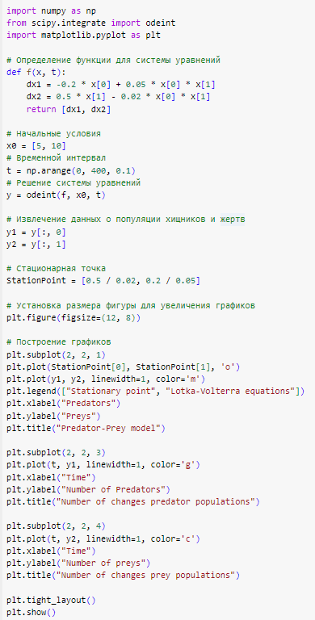
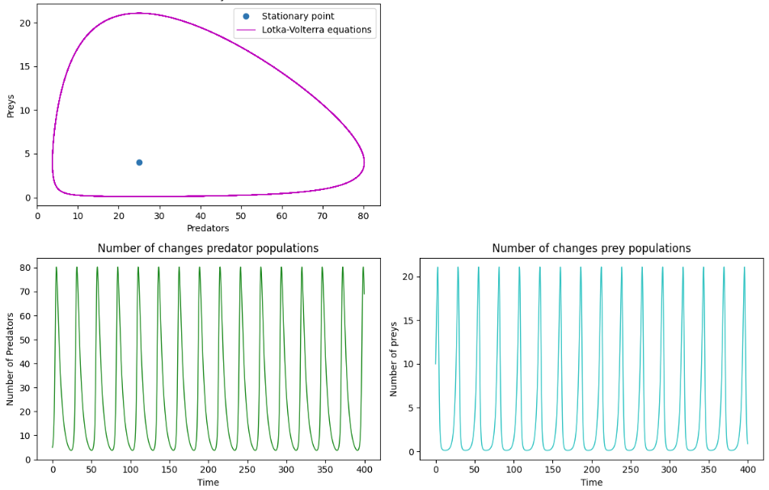

---
## Front matter
lang: ru-RU
title: Групповой проект №4. Этап №2.
subtitle: Научное программирование 
author:
  - Леонтьева К.А. $\; \;$ Минов К.В. $\; \;$ Назарьин А.И. $\; \;$ Полиенко А.Н.
institute:
  - НПМмд-02-23

## i18n babel
babel-lang: russian
babel-otherlangs: english

## Fonts
mainfont: PT Serif
romanfont: PT Serif
sansfont: PT Sans
monofont: PT Mono
mainfontoptions: Ligatures=TeX
romanfontoptions: Ligatures=TeX
sansfontoptions: Ligatures=TeX,Scale=MatchLowercase
monofontoptions: Scale=MatchLowercase,Scale=0.9

## Formatting pdf
toc: false
toc-title: Содержание
slide_level: 2
aspectratio: 169
section-titles: true
theme: metropolis
header-includes:
 - \metroset{progressbar=frametitle,sectionpage=progressbar,numbering=fraction}
 - '\makeatletter'
 - '\beamer@ignorenonframefalse'
 - '\makeatother'
---

# Модель Лотки-Вольтерры (модель "хищник-жертва"): Комплекс программ, описание программной реализации.  

## Комплекс программ

Для решения поставленной задачи использовался язык программирования Python и его библиотеки.

Python - это высокоуровневый язык программирования, который широко используется для решения математических задач. Он предоставляет простой и читаемый синтаксис, что упрощает создание и понимание кода. Python обладает богатой экосистемой математических библиотек, таких как NumPy, SciPy и Matplotlib, которые упрощают работу с числами, алгоритмами и графиками. 

## Программная реализация 

## Вывод программы

## Выводы
В ходе 3 этапа построения математической модели "Хищник-Жертва" мы программно реализовали модель, используя язык программирования Python. Отобразили графичкески зависимости между популяциями хищников и жертв.

