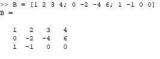
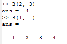
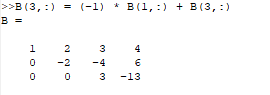
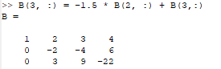
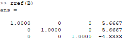
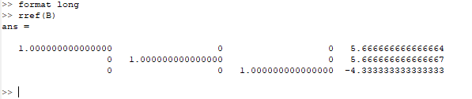
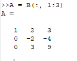
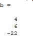
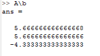
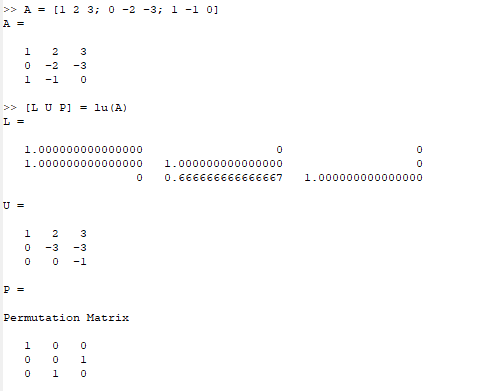

---
## Front matter
title: "Лабораторная работа 4"
subtitle: "Научное программирование"
author: "Минов Кирилл Вячеславович | НПМмд-02-23"

## Generic otions
lang: ru-RU
toc-title: "Содержание"

## Bibliography
bibliography: bib/cite.bib
csl: pandoc/csl/gost-r-7-0-5-2008-numeric.csl

## Pdf output format
toc: true # Table of contents
toc-depth: 2
lof: true # List of figures
lot: true # List of tables
fontsize: 12pt
linestretch: 1.5
papersize: a4
documentclass: scrreprt
## I18n polyglossia
polyglossia-lang:
  name: russian
  options:
	- spelling=modern
	- babelshorthands=true
polyglossia-otherlangs:
  name: english
## I18n babel
babel-lang: russian
babel-otherlangs: english
## Fonts
mainfont: PT Serif
romanfont: PT Serif
sansfont: PT Sans
monofont: PT Mono
mainfontoptions: Ligatures=TeX
romanfontoptions: Ligatures=TeX
sansfontoptions: Ligatures=TeX,Scale=MatchLowercase
monofontoptions: Scale=MatchLowercase,Scale=0.9
## Biblatex
biblatex: true
biblio-style: "gost-numeric"
biblatexoptions:
  - parentracker=true
  - backend=biber
  - hyperref=auto
  - language=auto
  - autolang=other*
  - citestyle=gost-numeric
## Pandoc-crossref LaTeX customization
figureTitle: "Рис."
tableTitle: "Таблица"
listingTitle: "Листинг"
lofTitle: "Список иллюстраций"
lotTitle: "Список таблиц"
lolTitle: "Листинги"
## Misc options
indent: true
header-includes:
  - \usepackage{indentfirst}
  - \usepackage{float} # keep figures where there are in the text
  - \floatplacement{figure}{H} # keep figures where there are in the text
---

# Цель работы

Изучить встроенные в Octave алгоритмы, необходимые для решения систем линейных уравнений.

# Теоретическое введение

Octave — высокоуровневый интерпретируемый язык программирования, предназначенный для решения задач вычислительной математики. По возможностям и качеству реализации интерпретатора язык Octave можно сравнивать с проприетарной программой MATLAB, причём синтаксис обоих языков очень схож. В состав пакета входит интерактивный командный интерфейс (интерпретатор Octave). Интерпретатор Octave запускается из терминала ОС Linux или из его порта в Windows. После запуска Octave пользователь видит окно интерпретатора.

Метод Гаусса

Запишем исходную систему

\begin{align*}
a_{1}^{1}x^{1} + \ldots + a_{n}^{1}x^{n} &= b^{1} \\
&\vdots \\
a_{1}^{m}x^{1} + \ldots + a_{n}^{m}x^{n} &= b^{m}
\end{align*}

в матричном виде Ax = b: 
Матрица A называется основной матрицей системы, b — столбцом свободных членов. Алгоритм решения СЛАУ методом Гаусса подразделяется на два этапа:

на первом этапе осуществляется  прямой ход, когда путём элементарных преобразований над строками систему приводят к ступенчатой или треугольной форме, либо устанавливают, что система несовместна;

на втором этапе осуществляется  обратный ход, суть которого заключается в том, чтобы выразить все получившиеся базисные переменные через небазисные и построить фундаментальную систему решений, либо, если все переменные являются базисными, то выразить в численном виде единственное решение системы линейных уравнений.

Для приведения матрицы к треугольному виду для системы уравнений используют расширенную матрицу.

LU-разложение

LU-разложение — это вид факторизации матриц для метода Гаусса

# Выполнение лабораторной работы

Для системы линейных уравнений:

\[ 
\begin{bmatrix}
1 & 2 & 3 \\
0 & -2 & -4 \\
1 & -1 & 0 
\end{bmatrix}
\begin{bmatrix}
x^1 \\
x^2 \\
x^3
\end{bmatrix}
\]

построим расширенную матрицу вида
B = [A|𝑏] = 
\[
\left[
\begin{array}{ccc|c}
1 & 2 & 3 & 4 \\
0 & -2 & -4 & 6 \\
1 & -1 & 0 & 0
\end{array}
\right]
\]

Можно её просматривать поэлементно:

Реализуем теперь явно метод Гаусса:

Сначала добавим к третьей строке первую строку, умноженную на −1:

Далее добавим к третьей строке вторую строку, умноженную на −1.5:

Выведем явно решение системы, а затем воспользуемся встроенной командой

Octave располагает встроенной командой для непосредственного поиска треугольной формы матрицы:

Переменные на самом деле хранятся с более высокой точностью, и при желании можно отобразить больше десятичных разрядов:

Встроенная операция для решения линейных систем вида Ax = b в Octave называется левым делением и записывается как A\B 
Это концептуально эквивалентно выражению \[ A^{-1} \] Выделим из расширенной матрицы B матрицу A и вектор b. 
После чего найдем вектор x.

Пусть дана матрица:
$A = \begin{bmatrix} 1& 2& 3\ 0& -2& -4\ 1& -1& 0 \end{bmatrix}$

С помощью Octave распишем её LU-разложение и найдем вектор 

# Выводы

В ходе выполнения данной лабораторной работы я изучил встроенные в Octave алгоритмы, необходимые для решения систем линейных уравнений.

# Список литературы{.unnumbered}

::: {#refs}
:::
