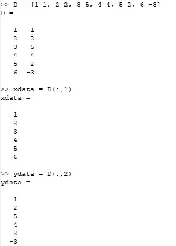
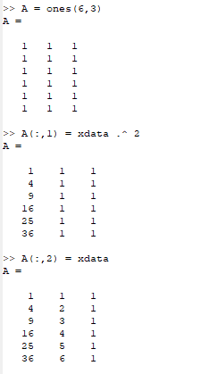
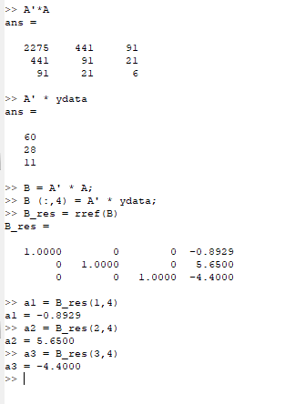
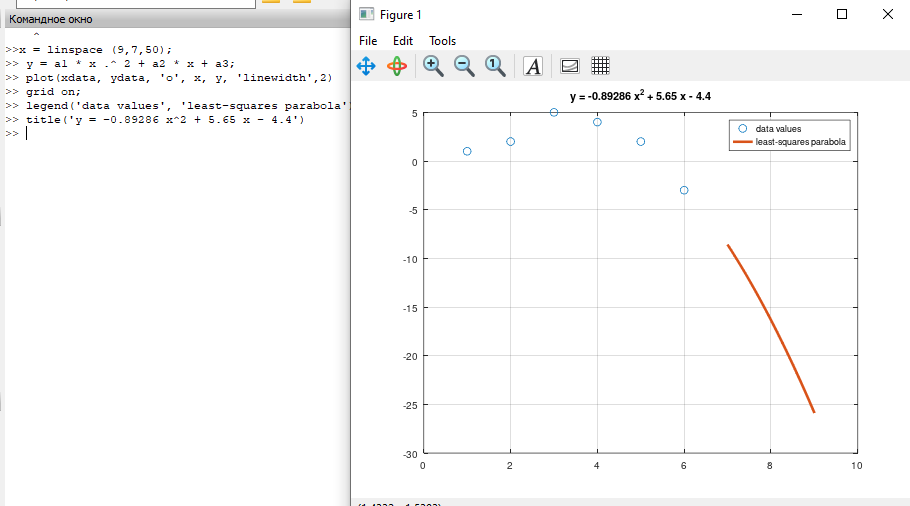
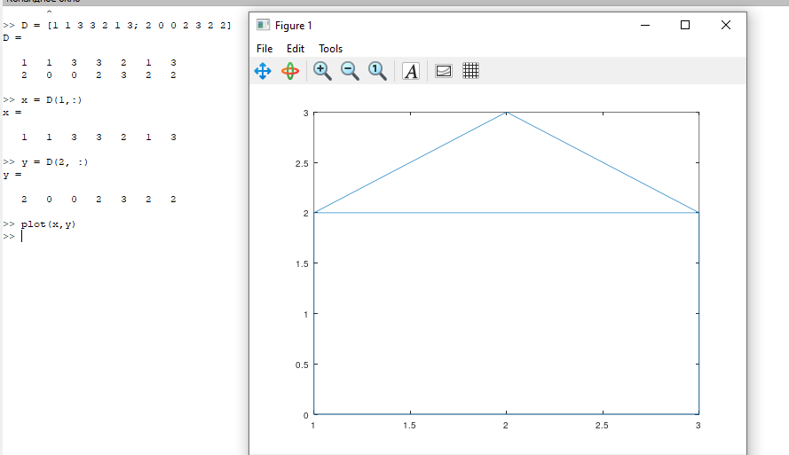
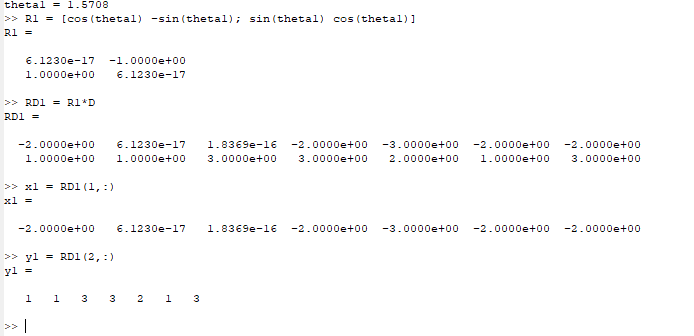
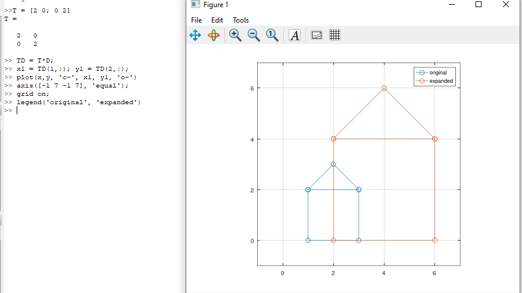
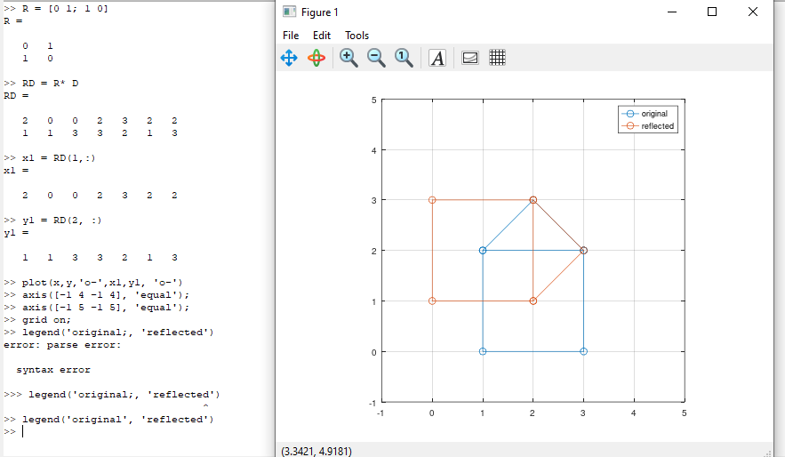

---
## Front matter
lang: ru-RU
title: Лабораторная работа №5
subtitle: Научное программирование
author:
  - Минов К. М., НПМмд-02-23
institute:
  - Российский университет дружбы народов, Москва, Россия

date: 23 сентября 2023

## i18n babel
babel-lang: russian
babel-otherlangs: english

## Formatting pdf
toc: false
toc-title: Содержание
slide_level: 2
aspectratio: 169
section-titles: true
theme: metropolis
header-includes:
 - \metroset{progressbar=frametitle,sectionpage=progressbar,numbering=fraction}
 - '\makeatletter'
 - '\beamer@ignorenonframefalse'
 - '\makeatother'
---

## Цель лабораторной работы

Изучить в Octave методы подгонки полиномиальной кривой, способы представления изображения в виде матрицы и действия над ним: вращение, отражение и дилатацию

## Теоретическое введение

Интерполяция - способ нахождения промежуточных значений величины по имеющемуся дискретному набору известных значений. Интерполяция функций часто встречается при ограниченности возможностей при проведении эксперимента.

Аппроксимация - замена одних математических объектов другими, в том или ином смысле близкими к исходным. При интерполировании интерполирующая функция строго проходит через узловые точки таблицы вследствие того, что количество коэффициентов в интерполирующей функции равно количеству табличных значений. Аппроксимация – метод приближения, при котором для нахождения дополнительных значений, отличных от табличных данных, приближенная функция проходит не через узлы интерполяции, а между ними.

# Ход выполнения лабораторной работы

По матрице, в которой заданы значения x в столбце 1 и значения y в столбце 2, рисуем точки на графике
Строим уравнение вида y = ax^2 + bx + c, применяя метод наименьших квадратов и метод Гаусса

# Ход выполнения лабораторной работы
Строим граф-домик с помощью матрицы, выбрав путь, который проходит по каждому ребру ровно один раз

# Ход выполнения лабораторной работы

Осуществим поворот графа дома на 90 и 225 градусов, переведя углы в радианы, и построим соответствующие графики

# Ход выполнения лабораторной работы

Осуществим отражение графа дома относительно прямой , задав матрицу отражения, а также увеличим граф дома в 2 раза

## Вывод

 ходе выполнения данной лабораторной работы я изучил в Octave методы подгонки полиномиальной кривой, способы представления изображения в виде матрицы и действия над ним: вращение, отражение и дилатацию
