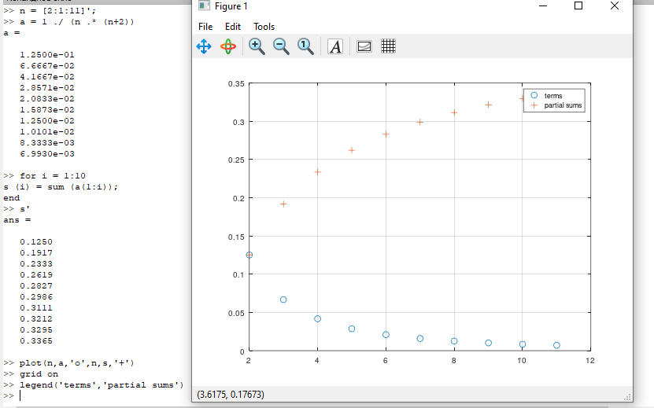
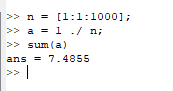
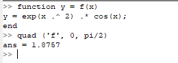
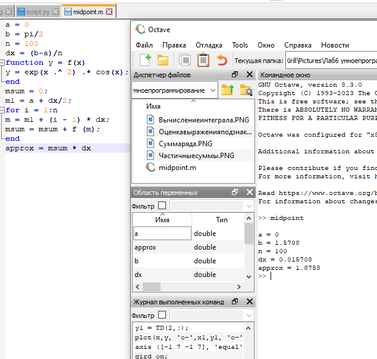
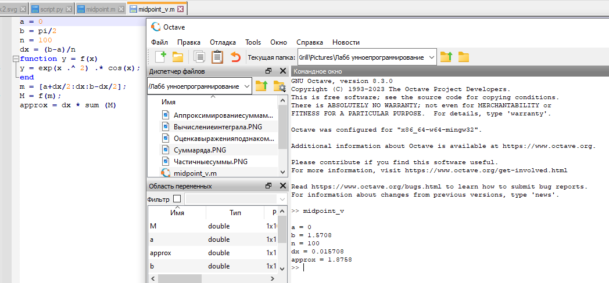
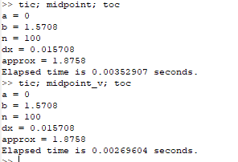

---
## Front matter
lang: ru-RU
title: Лабораторная работа №6
subtitle: Научное программирование
author:
  - Минов К. М., НПМмд-02-23
institute:
  - Российский университет дружбы народов, Москва, Россия

date: 23 сентября 2023

## i18n babel
babel-lang: russian
babel-otherlangs: english

## Formatting pdf
toc: false
toc-title: Содержание
slide_level: 2
aspectratio: 169
section-titles: true
theme: metropolis
header-includes:
 - \metroset{progressbar=frametitle,sectionpage=progressbar,numbering=fraction}
 - '\makeatletter'
 - '\beamer@ignorenonframefalse'
 - '\makeatother'
---

# Цель работы

Изучить в Octave методы расчета пределов, частичных сумм, суммы ряда, а также методы вычисления интегралов и аппроксимирования суммами.

# Теоретическое введение

Анонимная функция - особый вид функций, которые объявляются в месте использования и не получают уникального идентификатора для доступа к ним. Обычно при создании анонимные функции либо вызываются напрямую, либо ссылка на функцию присваивается переменной, с помощью которой затем можно косвенно вызывать данную функцию.

В Octave aнонимные функции определяются с помощью синтаксиса @(argument-list) expression. Любые переменные, которые не найдены в списке аргументов, наследованы от объема включения. Анонимные функции полезны для создания простых функций без имени от выражений или для обертывания вызовов к другим функциям для адаптации их к использованию функциями как quad, которая применяется при вычислении интегралов.

# Выполнение лабораторной работы

Оценка выражения под знаком предела

{#fig:001 width=80%}

# Выполнение лабораторной работы

Частичные суммы

{#fig:003 width=110%}

# Выполнение лабораторной работы
 
 Сумма ряда

{#fig:004 width=40%}

# Выполнение лабораторной работы
 Вычисление интеграла
 
{#fig:005 width=80%}

# Выполнение лабораторной работы
Аппроксимирование суммами

{#fig:006 width=80%}

{#fig:007 width=60%}

# Выполнение лабораторной работы
Сравнение кодов

{#fig:010 width=80%}

# Выводы

В ходе выполнения данной лабораторной работы я изучил в Octave методы расчета пределов, частичных сумм, суммы ряда, а также методы вычисления интегралов и аппроксимирования суммами.

