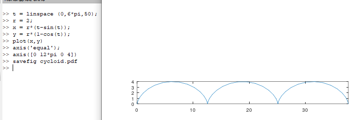
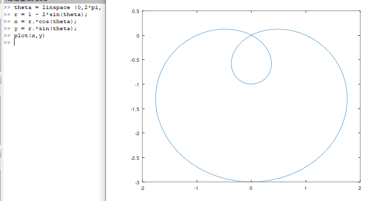
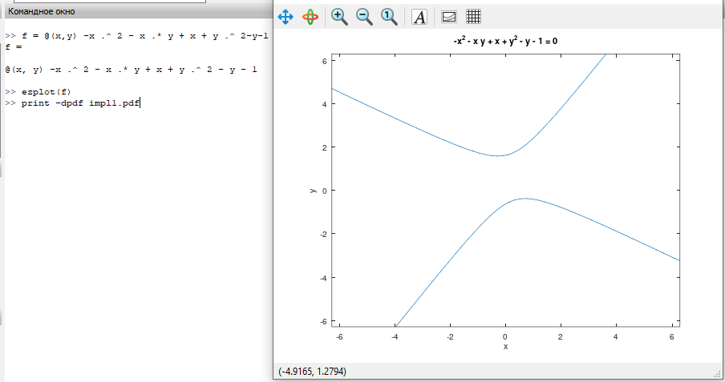
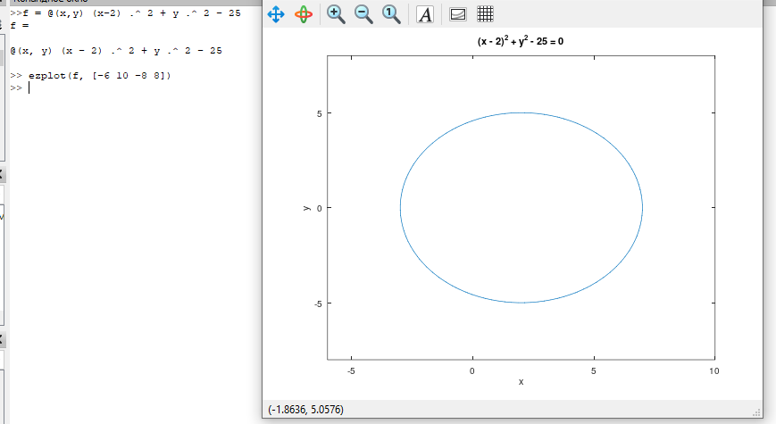
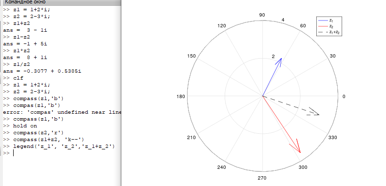
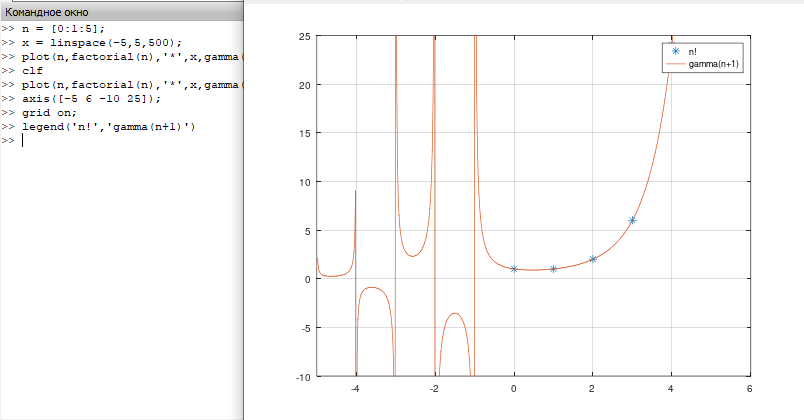
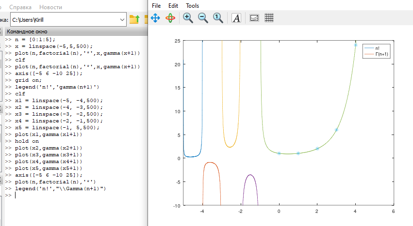

---
## Front matter
lang: ru-RU
title: Лабораторная работа №7
subtitle: Научное программирование
author:
  - Минов К. М., НПМмд-02-23
institute:
  - Российский университет дружбы народов, Москва, Россия

date: 9 декабря 2023

## i18n babel
babel-lang: russian
babel-otherlangs: english

## Formatting pdf
toc: false
toc-title: Содержание
slide_level: 2
aspectratio: 169
section-titles: true
theme: metropolis
header-includes:
 - \metroset{progressbar=frametitle,sectionpage=progressbar,numbering=fraction}
 - '\makeatletter'
 - '\beamer@ignorenonframefalse'
 - '\makeatother'
---

# Цель работы

Изучить в Octave методы построения различных графиков и работы с комплексными числами и специальными функциями

# Теоретическое введение
Гамма функция находит очень широкое применение в прикладном анализе. С гамма-функцией связаны функции Бесселя используемые при синтезе фильтров и спектральном анализе. В статистике широко используется гамма-распределение. 

# Выполнение лабораторной работы

Параметрические уравнения для циклоиды
{ #fig:001 width=70% }

# Выполнение лабораторной работы

Построили улитку Паскаля
{ #fig:003 width=70% }

# Выполнение лабораторной работы

Построили функцию, неявно определенную уравнением
{ #fig:003 width=70% }
{ #fig:003 width=70% }
{ #fig:003 width=70% }

# Выполнение лабораторной работы
Вывели основные арифметические операции с комплексными числами и построили графики
{ #fig:006 width=50% }

# Выполнение лабораторной работы
Использовали специальные функции для построения графиков
{ #fig:008 width=75% }
{ #fig:008 width=75% }

# Выводы

В ходе выполнения данной лабораторной работы я изучил в Octave методы построения различных графиков и работы с комплексными числами и специальными функциями

