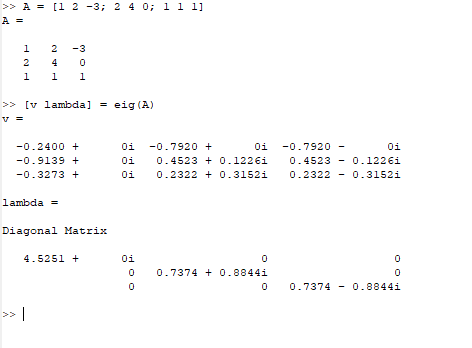
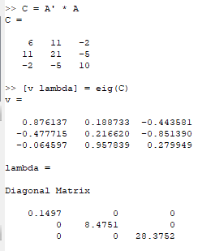
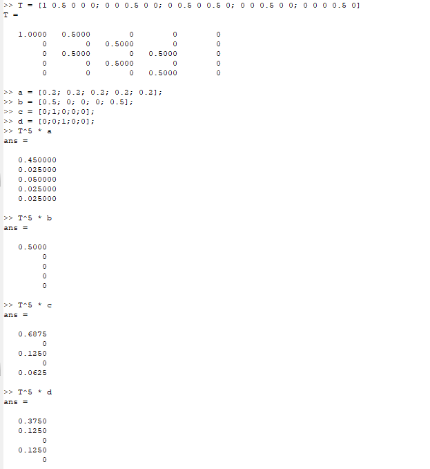
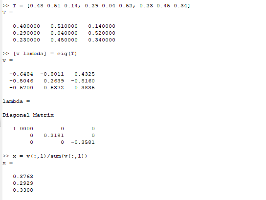
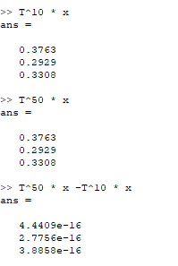

---
## Front matter
lang: ru-RU
title: Лабораторная работа №8
subtitle: Научное программирование
author:
  - Минов К. М., НПМмд-02-23
institute:
  - Российский университет дружбы народов, Москва, Россия

date: 9 декабря 2023

## i18n babel
babel-lang: russian
babel-otherlangs: english

## Formatting pdf
toc: false
toc-title: Содержание
slide_level: 2
aspectratio: 169
section-titles: true
theme: metropolis
header-includes:
 - \metroset{progressbar=frametitle,sectionpage=progressbar,numbering=fraction}
 - '\makeatletter'
 - '\beamer@ignorenonframefalse'
 - '\makeatother'
---

# Цель работы

Изучить в Octave методы работы с собственными значениями и собственными векторами, а также с марковскими цепями 

# Теоретическое введение

Ненулевой вектор u, который при умножении на некоторую квадратную матрицу  A превращается в самого же себя с числовым коэффициентом l, 
называется собственным вектором матрицы A. Число l называется собственным значением или собственным числом данной матрицы.

# Выполнение лабораторной работы
Нашли собственные значения и собственные векторы заданной матрицы

# Выполнение лабораторной работы
Получили матрицу с действительными собственными значениями, создав симметричную матрицу  путем умножения матрицы  A на транспонированную матрицу А

# Выполнение лабораторной работы
Для примера случайного блуждания нашли вектор вероятности после 5 шагов для каждого из заданных начальных векторов вероятности

# Выполнение лабораторной работы
Нашли вектор равновесного состояния для цепи Маркова с заданной переходной матрицей

# Выполнение лабораторной работы
Проверили правильность полученного результата

# Выводы
В ходе выполнения данной лабораторной работы я изучил в Octave методы работы с собственными значениями и собственными векторами, а также с марковскими цепями 

